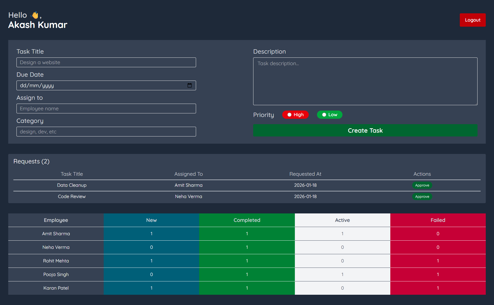
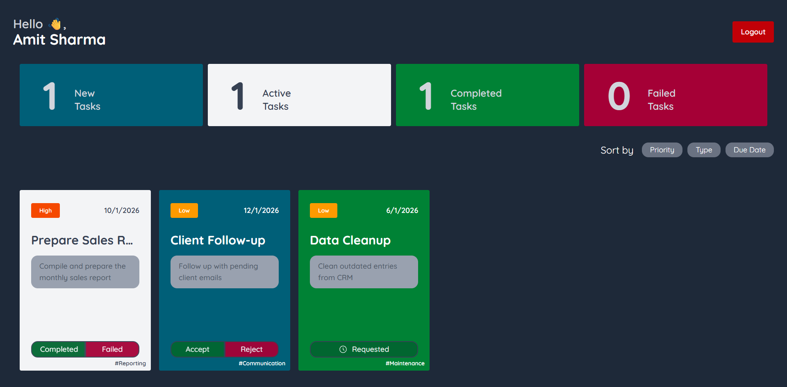
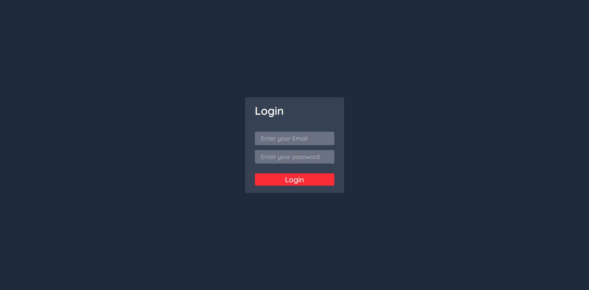

# Task List App 🗂️

A role-based task management application built with **React** that allows admins to assign tasks to employees and track their progress in real time.  
The app focuses on clean state management, reusable components, and persistent data using local storage.

---

## 🚀 Features

### 🔐 Authentication & Roles
- Admin login
- Employee login
- Role-based dashboards

### 📋 Task Management
- Admin can assign tasks to employees
- Tasks include:
  - New
  - Active
  - Completed
  - Failed
- Task counters update dynamically per employee

### 🧠 State Management
- Centralized global state using **React Context API**
- Immutable state updates
- Persistent storage using **localStorage**

### 🎨 UI & UX
- Clean and responsive layout
- Modular components
- Clear visual task status indicators

---

## 🛠️ Tech Stack

- **React**
- **Context API**
- **JavaScript (ES6+)**
- **CSS / Tailwind CSS**
- **LocalStorage**

---

## 📂 Project Structure

```
├── public/
│   └── vite.svg
├── src/
│   ├── components/
│   │   ├── Auth/
│   │   │   ├── Login.jsx
│   │   │   └── LoginForm.jsx
│   │   ├── Dashboard/
│   │   │   ├── AdminDashboard.jsx
│   │   │   └── EmployeeDashboard.jsx
│   │   ├── Misc/
│   │   │   ├── AdminTask.jsx
│   │   │   ├── AdminTaskListContainer.jsx
│   │   │   ├── CreateTask.jsx
│   │   │   ├── CreateTaskForm.jsx
│   │   │   ├── Header.jsx
│   │   │   ├── RemovalRequests.jsx
│   │   │   ├── Sorter.jsx
│   │   │   ├── TaskContainer.jsx
│   │   │   └── TaskCounter.jsx
│   │   └── Tasks/
│   │       ├── ActiveTask.jsx
│   │       ├── CompletedTask.jsx
│   │       ├── FailedTask.jsx
│   │       └── NewTask.jsx
│   ├── context/
│   │   ├── AuthContext.jsx
│   │   ├── AuthProvider.jsx
│   │   ├── TaskContext.jsx
│   │   └── TaskProvider.jsx
│   ├── utils/
│   │   ├── colorUtils.js
│   │   ├── LocalStorage.jsx
│   │   └── taskUtils.js
│   ├── App.jsx
│   ├── index.css
│   └── main.jsx
├── .gitignore
├── eslint.config.js
├── index.html
├── package-lock.json
├── package.json
├── README.md
└── vite.config.js

```


---

## 🧪 Key Learnings

- Proper usage of `useState`, `useEffect`, and `useContext`
- Avoiding direct state mutation
- Designing scalable global state
- Handling derived state (task counts)
- Role-based UI rendering
- Debugging common React pitfalls

---

## ⚠️ Current Limitations

- No backend (data resets on localStorage clear)
- No authentication security (demo-level auth)
- No pagination or filtering for large task lists

---

## 🔮 Future Improvements

- Backend integration (Node.js + Express)
- Database support (MongoDB / PostgreSQL)
- JWT-based authentication
- Task deadlines & priorities
- Search and filtering
- Performance optimizations ( useMemo )
- Unit and integration tests

---

## 📸 Screenshots


### Admin Dashboard and Add Task


### Employee Dashboard


### Login Page


---

## 📦 Installation & Setup

```bash
git clone https://github.com/your-username/task-list-app.git
cd task-list-app
npm install
npm run dev
```

## 👤 Author

**Akash**  
Frontend Developer  
React | JavaScript | UI Engineering

----------

## ⭐ Feedback

If you found this project helpful, feel free to ⭐ the repository or share feedback!

------
